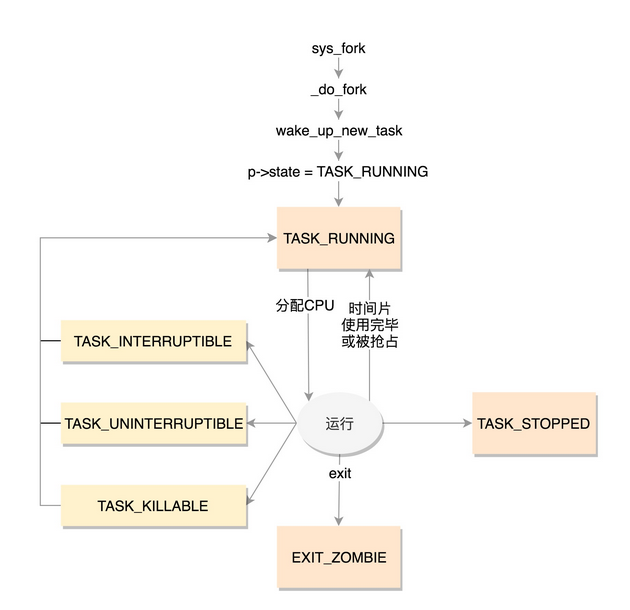

# Linux中的调度相关


## 任务状态


### 5个互斥状态

------

state域能够取5个互斥的值（通俗一点就是这五个值任意两个不能一起使用，只能单独使用）。系统中的每个进程都必然处于以上所列进程状态中的一种。

| 状态                 | 描述                                                         |
| -------------------- | ------------------------------------------------------------ |
| TASK_RUNNING         | 表示进程要么正在执行，要么正要准备执行（已经就绪），正在等待cpu时间片的调度 |
| TASK_INTERRUPTIBLE   | 进程因为等待一些条件而被挂起（阻塞）而所处的状态。这些条件主要包括：硬中断、资源、一些信号……，一旦等待的条件成立，进程就会从该状态（阻塞）迅速转化成为就绪状态TASK_RUNNING |
| TASK_UNINTERRUPTIBLE | 意义与TASK_INTERRUPTIBLE类似，除了不能通过接受一个信号来唤醒以外，对于处于TASK_UNINTERRUPIBLE状态的进程，哪怕我们传递一个信号或者有一个外部中断都不能唤醒他们。只有它所等待的资源可用的时候，他才会被唤醒。这个标志很少用，但是并不代表没有任何用处，其实他的作用非常大，特别是对于驱动刺探相关的硬件过程很重要，这个刺探过程不能被一些其他的东西给中断，否则就会让进城进入不可预测的状态 |
| TASK_STOPPED         | 进程被停止执行，当进程接收到SIGSTOP、SIGTTIN、SIGTSTP或者SIGTTOU信号之后就会进入该状态 |
| TASK_TRACED          | 表示进程被debugger等进程监视，进程执行被调试程序所停止，当一个进程被另外的进程所监视，每一个信号都会让进城进入该状态 |




TASK_RUNNING 并不是说进程正在运行，而是表示进程在时刻准备运行的状态。当处于这个状态的进程获得时间片的时候，就是在运行中；如果没有获得时间片，就说明它被其他进程抢占了，在等待再次分配时间片。


在运行中的进程，一旦要进行一些 I/O 操作，需要等待 I/O 完毕，这个时候会释放 CPU，进入睡眠状态。

在 Linux 中，有**两种睡眠状态**。

一种是**TASK_INTERRUPTIBLE**，**可中断的睡眠状态**。这是一种浅睡眠的状态，也就是说，虽然在睡眠，等待 I/O  完成，但是这个时候一个信号来的时候，进程还是要被唤醒。只不过唤醒后，不是继续刚才的操作，而是进行信号处理。当然程序员可以根据自己的意愿，来写信号处理函数，例如收到某些信号，就放弃等待这个 I/O 操作完成，直接退出，也可也收到某些信息，继续等待。

另一种睡眠是**TASK_UNINTERRUPTIBLE**，**不可中断的睡眠状态**。这是一种深度睡眠状态，不可被信号唤醒，只能死等 I/O 操作完成。一旦 I/O 操作因为特殊原因不能完成，这个时候，谁也叫不醒这个进程了。你可能会说，我 kill 它呢？别忘了，kill  本身也是一个信号，既然这个状态不可被信号唤醒，kill 信号也被忽略了。除非重启电脑，没有其他办法。

于是，我们就有了一种新的进程睡眠状态，**TASK_KILLABLE，可以终止的新睡眠状态**。进程处于这种状态中，它的运行原理类似 TASK_UNINTERRUPTIBLE，只不过可以响应致命信号。

TASK_STOPPED 是在进程接收到 SIGSTOP、SIGTTIN、SIGTSTP 或者 SIGTTOU 信号之后进入该状态。

TASK_TRACED 表示进程被 debugger 等进程监视，进程执行被调试程序所停止。当一个进程被另外的进程所监视，每一个信号都会让进程进入该状态。


## 优先级

------

```c
int prio, static_prio, normal_prio;
unsigned int rt_priority;12
```

| 字段        | 描述                                               |
| ----------- | -------------------------------------------------- |
| static_prio | 用于保存静态优先级，可以通过nice系统调用来进行修改 |
| rt_priority | 用于保存实时优先级                                 |
| normal_prio | 的值取决于静态优先级和调度策略                     |
| prio        | 用于保存动态优先级                                 |


## 调度策略与调度类

一种称为**实时进程**，也就是需要尽快执行返回结果的那种。这就好比我们是一家公司，接到的客户项目需求就会有很多种。有些客户的项目需求比较急，比如一定要在一两个月内完成的这种，客户会加急加钱，那这种客户的优先级就会比较高。

另一种是**普通进程**，大部分的进程其实都是这种。这就好比，大部分客户的项目都是普通的需求，可以按照正常流程完成，优先级就没实时进程这么高，但是人家肯定也有确定的交付日期。


## 1、调度策略选择 policy

在 task_struct 中，有一个成员变量，我们叫**调度策略**。 

```
unsigned int policy;
```

类型如下

```c
#define SCHED_NORMAL		0
#define SCHED_FIFO		1
#define SCHED_RR		2
#define SCHED_BATCH		3
#define SCHED_IDLE		5
#define SCHED_DEADLINE		6
```

配合调度策略的，还有我们刚才说的**优先级**，也在 task_struct 中。 

```
	int prio, static_prio, normal_prio;
	unsigned int rt_priority;
```

优先级其实就是一个数值，对于实时进程，优先级的范围是 0～99；对于普通进程，优先级的范围是 100～139。数值越小，优先级越高。从这里可以看出，所有的实时进程都比普通进程优先级要高。

### 1、实时调度策略 prio

**SCHED_FIFO、SCHED_RR、SCHED_DEADLINE**

1. **SCHED_FIFO**就是交了相同钱的，先来先服务，有的可以分配更高的优先级，也就是说，高优先级的进程可以抢占低优先级的进程，而相同优先级的进程，我们遵循先来先得。
2. **SCHED_RR 轮流调度算法**，采用时间片，相同优先级的任务当用完时间片会被放到队列尾部，以保证公平性，而高优先级的任务也是可以抢占低优先级的任务。
3. **SCHED_DEADLINE**，是按照任务的 deadline 进行调度的。当产生一个调度点的时候，DL 调度器总是选择其 deadline 距离当前时间点最近的那个任务，并调度它执行。

### 2、普通调度策略

既然大家的项目都没有那么紧急，就应该按照普通的项目流程，公平地分配人员。

**SCHED_NORMAL、SCHED_BATCH、SCHED_IDLE**

1. **SCHED_NORMAL** 是普通的进程
2. **SCHED_BATCH** 是后台进程，几乎不需要和前端进行交互。这类项目可以默默执行，不要影响需要交互的进程，可以降低他的优先级。
3. **SCHED_IDLE** 是特别空闲的时候才跑的进程，相当于咱们学习训练类的项目，比如咱们公司很长时间没有接到外在项目了，可以弄几个这样的项目练练手。


## 2、调度类

上面无论是 policy 还是 priority，都设置了一个变量，变量仅仅表示了应该这样这样干，但事情总要有人去干，谁呢？在 task_struct 里面，还有这样的成员变量：

```
const struct sched_class *sched_class;
```

**调度策略的执行逻辑，就封装在这里面，它是真正干活的那个。**

sched_class 有几种实现：

- stop_sched_class 优先级最高的任务会使用这种策略，**会中断所有其他线程，且不会被其他任务打断；**
- dl_sched_class 就对应上面的 deadline 调度策略；
- rt_sched_class 就对应 RR 算法或者 FIFO 算法的调度策略，具体调度策略由进程的 task_struct->policy 指定；
- fair_sched_class 就是普通进程的调度策略；
- idle_sched_class 就是空闲进程的调度策略。


### 完全公平调度算法 CFS	

普通进程使用的调度策略是 fair_sched_class，顾名思义，对于普通进程来讲，公平是最重要的。

CFS 全称 Completely Fair Scheduling，叫完全公平调度。

在这里得到当前的时间，以及这次的时间片开始的时间，两者相减就是这次运行的时间 delta_exec ，但是得到的这个时间其实是实际运行的时间，需要做一定的转化才作为虚拟运行时间 vruntime。转化方法如下：

​	` 虚拟运行时间 vruntime += 实际运行时间 delta_exec * NICE_0_LOAD/ 权重 `

同样的实际运行时间，给高权重的算少了，低权重的算多了，但是当选取下一个运行进程的时候，还是按照最小的 vruntime 来的，**这样高权重的获得的实际运行时间自然就多了。**相当于给一个体重 (权重)200 斤的胖子吃两个馒头，和给一个体重 100 斤的瘦子吃一个馒头，然后说，你们两个吃的是一样多。这样虽然总体胖子比瘦子多吃了一倍，但是还是公平的。

### 调度队列与调度实体

看来 CFS 需要一个数据结构来对 vruntime  进行排序，找出最小的那个。这个能够排序的数据结构不但需要查询的时候，能够快速找到最小的，更新的时候也需要能够快速的调整排序，要知道  vruntime 可是经常在变的，变了再插入这个数据结构，就需要重新排序。

能够平衡查询和更新速度的是树，在这里使用的是红黑树。

**红黑树的的节点是应该包括 vruntime 的，称为调度实体。**

对于普通进程的调度实体定义如下，这里面包含了 vruntime 和权重 load_weight，以及对于运行时间的统计。

```c
struct sched_entity {
	struct load_weight	load;		/* for load-balancing */
	struct rb_node		run_node;
	struct list_head	group_node;
	unsigned int		on_rq;

	u64			exec_start;
	u64			sum_exec_runtime;
	u64			vruntime;
	u64			prev_sum_exec_runtime;

	u64			nr_migrations;

#ifdef CONFIG_SCHEDSTATS
	struct sched_statistics statistics;
#endif

#ifdef CONFIG_FAIR_GROUP_SCHED
	int			depth;
	struct sched_entity	*parent;
	/* rq on which this entity is (to be) queued: */
	struct cfs_rq		*cfs_rq;
	/* rq "owned" by this entity/group: */
	struct cfs_rq		*my_q;
#endif

#ifdef CONFIG_SMP
	/* Per-entity load-tracking */
	struct sched_avg	avg;
#endif
};
```

类似下图


CPU 也是这样的，每个 CPU 都有自己的 struct rq 结构，其用于描述在此 CPU 上所运行的所有进程，其包括一个**实时进程队列  rt_rq 和一个 CFS 运行队列 cfs_rq**，在调度时，调度器首先会先去实时进程队列找是否有实时进程需要运行，如果没有才会去 CFS  运行队列找是否有进行需要运行。

**每个 CPU 都有自己的 struct rq 结构:**

```c
struct rq {
	/* runqueue lock: */
	raw_spinlock_t lock;
	unsigned int nr_running;
	unsigned long cpu_load[CPU_LOAD_IDX_MAX];
......
	struct load_weight load;
	unsigned long nr_load_updates;
	u64 nr_switches;

	struct cfs_rq cfs;
	struct rt_rq rt;
	struct dl_rq dl;
......
	struct task_struct *curr, *idle, *stop;
......
};
```

对于普通进程公平队列 cfs_rq，定义如下：

```c
/* CFS-related fields in a runqueue */
struct cfs_rq {
	struct load_weight load;
	unsigned int nr_running, h_nr_running;

	u64 exec_clock;
	u64 min_vruntime;
#ifndef CONFIG_64BIT
	u64 min_vruntime_copy;
#endif
	struct rb_root tasks_timeline;
	struct rb_node *rb_leftmost;

	struct sched_entity *curr, *next, *last, *skip;
......
};
```

这里面 rb_root 指向的就是红黑树的根节点，这个红黑树在 CPU 看起来就是一个队列，不断的取下一个应该运行的进程。rb_leftmost 指向的是最左面的节点。


### 调度类工作过程

调度类的定义如下：

```
struct sched_class {
	const struct sched_class *next;
```

next 是一个指针，指向下一个调度类。

这里我们以调度最常见的操作，**取下一个任务**为例，来解析一下。


在每个 CPU 上都有一个队列 rq，这个队列里面包含多个子队列，例如 rt_rq 和 cfs_rq，不同的队列有不同的实现方式，cfs_rq 就是用红黑树实现的。

当有一天，某个 CPU 需要找下一个任务执行的时候，会按照优先级依次调用调度类，不同的调度类操作不同的队列。当然 rt_sched_class  先被调用，它会在 rt_rq 上找下一个任务，只有找不到的时候，才轮到 fair_sched_class 被调用，它会在 cfs_rq  上找下一个任务。这样保证了实时任务的优先级永远大于普通任务。


### 查看调度 chrt

```shell
husharp@hjh-Ubuntu:~$ chrt -p 32
pid 32 当前的调度策略︰ SCHED_OTHER
pid 32 的当前调度优先级：0
```

--->>>HuSharp OS 中的调度算法


